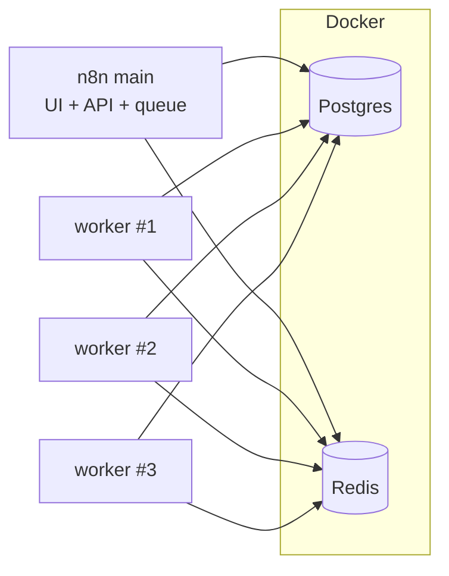

# Hướng dẫn chạy production (main + worker)

Chạy n8n **đã build** (không hot reload), dùng **queue mode** với Postgres + Redis — phù hợp deploy server / LAN.

Xem thêm: [huong-dan-cai-dat.md](./huong-dan-cai-dat.md) (cài đặt), [huong-dan-chay.md](./huong-dan-chay.md) (dev hàng ngày).

## Kiến trúc



| Process | Lệnh | Vai trò |
|---------|------|---------|
| **Main** | `n8n start` | Web UI, REST API, đẩy execution vào queue |
| **Worker** | `n8n worker` | Lấy job từ Redis và chạy workflow |

> Với `EXECUTIONS_MODE=queue` trong `n8n.env`, **bắt buộc** có ít nhất **1 worker**. Không có worker → workflow treo trong queue.

---

## 1. Chuẩn bị (một lần / mỗi lần deploy code mới)

### Postgres + Redis

```powershell
docker compose -f docker/kito-n8n/docker-compose.yml up -d
```

### Build toàn bộ

```powershell
cd E:\CODE\N8N\n8n

# Custom node RM (nếu dùng)
cd custom\n8n-nodes-rm-workflow
pnpm install
pnpm build
cd ..\..\

# Build monorepo (frontend + backend)
pnpm build
```

### File env

```powershell
copy docker\kito-n8n\n8n.env packages\cli\bin\.env
```

Chỉnh `.env` cho môi trường production:

| Biến | Gợi ý prod |
|------|------------|
| `N8N_CUSTOM_EXTENSIONS` | Đường dẫn **tuyệt đối** trên server (không dùng path máy dev) |
| `N8N_HOST` | `0.0.0.0` nếu cần LAN truy cập |
| `N8N_PORT` | `5678` (mặc định) |
| `N8N_PROTOCOL` | `http` hoặc `https` |
| `WEBHOOK_URL` | URL public mà webhook bên ngoài gọi được, vd `http://192.168.1.15:5678/` |
| `NODE_ENV` | `production` (tuỳ chọn, khuyên dùng) |

> File `.env` đặt tại `packages/cli/bin/.env`. **Luôn chạy lệnh prod từ thư mục `packages/cli/bin`** để n8n đọc đúng env (dotenv load theo `cwd`).

---

## 2. Chạy production

Mở terminal, **cd vào `bin`**:

```powershell
cd E:\CODE\N8N\n8n\packages\cli\bin
```

### Terminal 1 — Main

```powershell
node n8n start
```

→ UI: http://localhost:5678 (hoặc IP LAN nếu `N8N_HOST=0.0.0.0`)

### Terminal 2 — 3 worker (một lệnh)

Từ `packages\cli` (có `concurrently`):

```powershell
cd E:\CODE\N8N\n8n\packages\cli
pnpm exec concurrently -n "w1,w2,w3" -c "cyan,green,blue" "node bin/n8n worker" "node bin/n8n worker" "node bin/n8n worker"
```

**CMD:**

```cmd
cd E:\CODE\N8N\n8n\packages\cli
pnpm exec concurrently -n w1,w2,w3 "node bin/n8n worker" "node bin/n8n worker" "node bin/n8n worker"
```

Mỗi worker mặc định **concurrency = 10** (tối đa 10 execution song song / worker).  
3 worker × 10 ≈ **30 execution** đồng thời.

Giới hạn thấp hơn:

```powershell
pnpm exec concurrently -n "w1,w2,w3" ^
  "node bin/n8n worker --concurrency=5" ^
  "node bin/n8n worker --concurrency=5" ^
  "node bin/n8n worker --concurrency=5"
```

Hoặc set env (áp dụng cho mọi worker):

```env
N8N_CONCURRENCY_PRODUCTION_LIMIT=5
```

---

## 3. Chạy nền với PM2 (khuyên dùng trên server)

Cài PM2: `npm install -g pm2`

Tạo `ecosystem.config.cjs` tại root repo (điều chỉnh `cwd` nếu deploy path khác):

```javascript
const binDir = 'E:/CODE/N8N/n8n/packages/cli/bin';
const cliDir = 'E:/CODE/N8N/n8n/packages/cli';

module.exports = {
  apps: [
    {
      name: 'n8n-main',
      cwd: binDir,
      script: 'n8n',
      interpreter: 'node',
      args: 'start',
      env: { NODE_ENV: 'production' },
    },
    {
      name: 'n8n-worker',
      cwd: binDir,
      script: 'n8n',
      interpreter: 'node',
      args: 'worker --concurrency=10',
      instances: 3,
      exec_mode: 'fork',
      env: { NODE_ENV: 'production' },
    },
  ],
};
```

```powershell
cd E:\CODE\N8N\n8n
pm2 start ecosystem.config.cjs
pm2 save
pm2 status
pm2 logs n8n-main
pm2 logs n8n-worker
```

Dừng:

```powershell
pm2 stop all
pm2 delete all
```

---

## 4. Cập nhật sau khi sửa code

```powershell
cd E:\CODE\N8N\n8n
pnpm build
# restart main + worker (Ctrl+C hoặc pm2 restart all)
```

Sửa `n8n.env` / `.env`:

```powershell
copy docker\kito-n8n\n8n.env packages\cli\bin\.env
# chỉnh lại path prod nếu cần → restart main + worker
```

---

## 5. So sánh dev vs prod

| | Dev | Prod |
|---|-----|------|
| Main | `pnpm dev:be` (watch + nodemon) | `node n8n start` trong `packages/cli/bin` |
| Worker | `pnpm run dev:worker` (watch) | `node n8n worker` (không watch) |
| Frontend | Có thể `pnpm dev:fe:editor` (:8080) | UI đã embed trong build, chỉ :5678 |
| Build | Tự compile khi dev | `pnpm build` trước khi chạy |

---

## 6. Lỗi thường gặp

| Hiện tượng | Cách xử lý |
|------------|------------|
| Workflow không chạy / treo | Thiếu worker hoặc Redis down |
| `EXECUTIONS_MODE` không phải queue | Kiểm tra `.env`, `EXECUTIONS_MODE=queue` |
| Custom node không thấy | Build `custom/n8n-nodes-rm-workflow`, đúng `N8N_CUSTOM_EXTENSIONS` |
| Webhook không nhận từ internet | Set `WEBHOOK_URL` đúng URL public |
| Env không ăn | Chạy từ `packages/cli/bin` hoặc export biến môi trường trước khi start |

---

## 7. Dừng dịch vụ

- Process thủ công: `Ctrl+C` từng terminal
- PM2: `pm2 stop all`
- Docker (giữ data): `docker compose -f docker/kito-n8n/docker-compose.yml stop`
