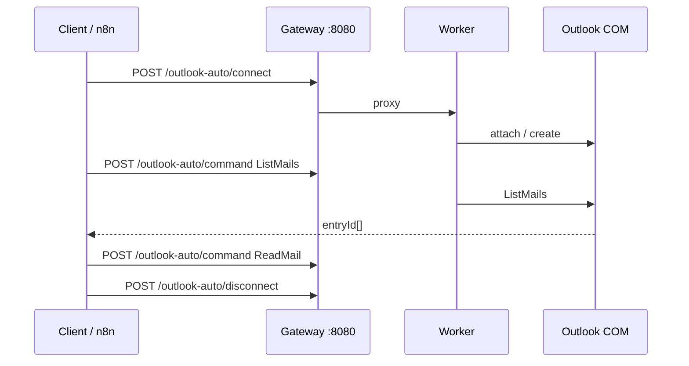

# API Outlook-auto — Microsoft Outlook desktop (COM)

Tài liệu tham chiếu HTTP **`/outlook-auto/*`** trên worker **RMIV.WF.CLIENT** (Gateway proxy). Điều khiển **Outlook desktop** qua COM (`OutlookAutomationManager`), cùng process với SAP / Web / File.

| | |
|--|--|
| **HTTP (public)** | `GET /docs/HUONG-DAN-API-OUTLOOK.md` |
| **Function list** | `GET /outlook-auto/function/list` |
| **Command** | `POST /outlook-auto/command` · `function` = tên hàm |
| **Gateway** | thường `:8080` / `:8081` · Worker loopback `:18080` |

**Yêu cầu:** Windows + Outlook desktop đã cài; worker chạy STA (mặc định). Mọi lệnh Outlook được marshal lên UI thread giống SAP.

**Danh sách hàm live (JSON):** [http://127.0.0.1:8080/outlook-auto/function/list](http://127.0.0.1:8080/outlook-auto/function/list) (không bắt buộc `api-key`).

**Tài liệu này qua HTTP:** [http://127.0.0.1:8080/docs/HUONG-DAN-API-OUTLOOK.md](http://127.0.0.1:8080/docs/HUONG-DAN-API-OUTLOOK.md)

Cấu hình HTTP server chung (port, firewall, `server-config.txt`): `HUONG-DAN-API-SAP.md` §3–§7.

---

## Mục lục

### A. Chung
1. [Luồng & xác thực](#1-luồng--xác-thực)
2. [Route](#2-route)
3. [Cách gọi command](#3-cách-gọi-command)
4. [Bảng tổng hợp hàm](#4-bảng-tổng-hợp-hàm)
5. [Kiểu Result](#5-kiểu-result)

### B. Session & thư mục
6. [Connect / Disconnect](#6-connect--disconnect)
7. [GetSessionInfo / ListFolders / OpenFolder](#7-getsessioninfo--listfolders--openfolder)

### C. Mail
8. [ListMails / SearchMails](#8-listmails--searchmails)
9. [ReadMail / DisplayMail / GetSelectedMail](#9-readmail--displaymail--getselectedmail)
10. [SendMail / ReplyMail / ForwardMail](#10-sendmail--replymail--forwardmail)
11. [MarkAsRead / MoveMail / DeleteMail](#11-markasread--movemail--deletemail)
12. [SaveAttachment](#12-saveattachment)

### D. UI / phím
13. [ActivateOutlook / CloseInspector](#13-activateoutlook--closeinspector)
14. [SendKeys / SendKeySequence](#14-sendkeys--sendkeysequence)

### E. Vận hành
15. [Quản lý session](#15-quản-lý-session)
16. [Response & lỗi](#16-response--lỗi)
17. [Luồng tích hợp & n8n](#17-luồng-tích-hợp--n8n)

---

## 1) Luồng & xác thực

```
n8n / client
  │  POST /outlook-auto/connect      { sessionId, attachExisting, … }
  │  POST /outlook-auto/command      { sessionId, function, paramObject }
  │  POST /outlook-auto/disconnect   { sessionId }
  ▼
Gateway  ──proxy──►  Worker  ──►  OutlookAutomationManager (COM / STA)
```

```http
api-key: <key Gateway / server-config>
Content-Type: application/json
```

(Docs + `/outlook-auto/function/list` **không** bắt buộc `api-key`.)

**Quy tắc quan trọng**

- `sessionId` = GUID chuẩn (n8n / client tự tạo).
- Idle mặc định **5 phút** (giống web). Gửi `idleTimeoutMinutes` khi connect để ghi đè.
- `MaxOutlookSessions` mặc định **3**.
- Disconnect **không** `Quit` Outlook nếu session chỉ **attach** vào instance user đang dùng.
- **Không có** `CloseOutlook` / `Quit` qua command — muốn đóng cửa sổ email → `CloseInspector` / `CloseAllInspectors`.

---

## 2) Route

| Method | Path | Auth | Mô tả |
|--------|------|------|--------|
| `GET` | `/docs/HUONG-DAN-API-OUTLOOK.md` | Public | Tài liệu này |
| `GET`/`POST` | `/outlook-auto/function/list` (alias `/outlook-auto/list`) | Public | Liệt kê hàm runtime |
| `POST` | `/outlook-auto/connect` | `api-key` | Mở / gắn session Outlook |
| `POST` | `/outlook-auto/command` | `api-key` | Gọi hàm |
| `POST` | `/outlook-auto/disconnect` | `api-key` | Gỡ session API |
| `POST` | `/outlook-auto/session/check` | `api-key` | Kiểm tra session |
| `GET` | `/outlook-auto/session/list` (alias `/outlook-auto/sessions`) | `api-key` | Liệt kê session |
| `POST` | `/outlook-auto/session/kill-all` | `api-key` | Đóng hết session Outlook API |

Base URL ví dụ: `http://192.168.1.50:8080` (Gateway) hoặc `http://127.0.0.1:18080` (worker loopback).

---

## 3) Cách gọi command

```json
{
  "sessionId": "11111111-1111-1111-1111-111111111111",
  "function": "ListMails",
  "paramObject": {
    "folderPath": "Inbox",
    "maxCount": "20",
    "unreadOnly": "true"
  }
}
```

| Cách truyền tham số | Ghi chú |
|---------------------|---------|
| **`paramObject`** | Khuyến nghị — named, không phụ thuộc thứ tự |
| `params` | Mảng theo thứ tự overload (vd `["Inbox", "20", "true"]`) |
| `param` | Một tham số đơn |

**Ép kiểu qua HTTP**

| Kiểu C# | Cách gửi |
|---------|----------|
| `string` | Chuỗi |
| `bool` | `true` / `"true"` |
| `int` | Số hoặc `"20"` |
| Đường dẫn file nhiều file | Nối bằng `;` hoặc `\|` |

Response envelope:

```json
{
  "Success": true,
  "Message": "OK",
  "Result": { }
}
```

---

## 4) Bảng tổng hợp hàm

| `function` | Nhóm | Tóm tắt |
|------------|------|---------|
| `GetSessionInfo` | Session | Profile, user, store |
| `ListFolders` | Folder | Liệt kê thư mục con |
| `OpenFolder` | Folder | Đặt `CurrentFolder` trên Explorer |
| `ListMails` | Mail | Liệt kê mail trong folder |
| `SearchMails` | Mail | Tìm theo filter / subject |
| `ReadMail` | Mail | Đọc subject/body/html/attachments theo `entryId` |
| `DisplayMail` | Mail | Mở Inspector |
| `GetSelectedMail` | Mail | Mail đang chọn trên Explorer |
| `SendMail` | Gửi | Tạo & gửi (hoặc mở draft) |
| `ReplyMail` | Gửi | Trả lời / Reply All |
| `ForwardMail` | Gửi | Chuyển tiếp |
| `MarkAsRead` | Trạng thái | Đánh dấu đã đọc / chưa đọc |
| `MoveMail` | Di chuyển | Chuyển sang folder khác |
| `DeleteMail` | Xóa | Xóa (soft / permanent) |
| `SaveAttachment` | File | Lưu file đính kèm ra đĩa worker |
| `ActivateOutlook` | UI | Đưa cửa sổ Outlook lên trước |
| `CloseInspector` | UI | Đóng cửa sổ email đang mở |
| `CloseAllInspectors` | UI | Đóng mọi Inspector |
| `SendKeys` | Phím | Gửi một chuỗi SendKeys |
| `SendKeySequence` | Phím | Chuỗi bước cách `\|\|` + `{WAIT:ms}` |

> Property / helper nội bộ không gọi qua command. Danh sách overload chính xác: `GET /outlook-auto/function/list`.

---

## 5) Kiểu Result

Envelope chuẩn `ApiResponse` (giống SAP / Web / File):

```json
{
  "Success": true,
  "Message": "OK",
  "Result": { }
}
```

| Tình huống | Field chính trong `Result` |
|------------|----------------------------|
| List / Search | Mảng object mail (`entryId`, `subject`, `receivedTime`, `unread`, …) |
| `ReadMail` | `subject`, `body`, `htmlBody`, `to` / `cc`, `attachments[]` |
| `SendMail` / Reply / Forward | Thông tin gửi / `entryId` draft nếu có |
| `GetSessionInfo` | Profile, CurrentUser, store |
| `SaveAttachment` | Đường dẫn file đã lưu trên **máy worker** |
| Lỗi | `Success: false` + `Message` |

Luôn kiểm tra **`Success`** ở envelope; một số hàm còn có `Result.Success`.

---

## 6) Connect / Disconnect

### Connect

```http
POST /outlook-auto/connect
api-key: YOUR_KEY
Content-Type: application/json
```

```json
{
  "sessionId": "11111111-1111-1111-1111-111111111111",
  "attachExisting": true,
  "visible": true,
  "profileName": null,
  "idleTimeoutMinutes": 10
}
```

| Field | Bắt buộc | Mặc định | Mô tả |
|-------|----------|----------|--------|
| `sessionId` | Có | — | GUID |
| `attachExisting` | Không | `true` | Gắn Outlook đang chạy; nếu không có thì tạo process mới |
| `visible` | Không | `true` | Hiện cửa sổ Outlook |
| `profileName` | Không | null | Profile MAPI (hiếm khi cần) |
| `idleTimeoutMinutes` | Không | **5** | Tự disconnect khi idle; gửi số khác để ghi đè |

Cùng `sessionId` đã connect: gọi lại thường trả *Already connected* (không tạo instance mới).

### Disconnect / session check

```json
{ "sessionId": "11111111-1111-1111-1111-111111111111" }
```

```http
POST /outlook-auto/disconnect
POST /outlook-auto/session/check
```

**Lưu ý disconnect:** chỉ gỡ session API. Nếu session chỉ **attach** → **không** tắt Outlook của user.

---

## 7) GetSessionInfo / ListFolders / OpenFolder

### Thư mục quen thuộc

| Alias / tên | Ý nghĩa |
|-------------|---------|
| `Inbox` | Hộp thư đến |
| `Sent` / `Sent Items` | Đã gửi |
| `Drafts` | Nháp |
| `Deleted` / `Deleted Items` | Đã xóa |
| `Outbox` | Hộp thư đi |
| `Junk` | Thư rác |
| `Inbox/SubFolder` | Đường dẫn con |

### `GetSessionInfo`

Không bắt buộc tham số.

```json
{
  "sessionId": "...",
  "function": "GetSessionInfo",
  "paramObject": {}
}
```

### `ListFolders`

| Param | Bắt buộc | Mặc định | Mô tả |
|-------|----------|----------|--------|
| `folderPath` | Không | Inbox | Folder gốc để liệt kê con |

```json
{
  "sessionId": "...",
  "function": "ListFolders",
  "paramObject": { "folderPath": "Inbox" }
}
```

### `OpenFolder`

Đặt `CurrentFolder` trên Explorer (UI).

| Param | Bắt buộc | Mô tả |
|-------|----------|--------|
| `folderPath` | Có | vd `Inbox`, `Inbox/Báo cáo` |

```json
{
  "sessionId": "...",
  "function": "OpenFolder",
  "paramObject": { "folderPath": "Inbox" }
}
```

---

## 8) ListMails / SearchMails

### `ListMails`

| Param | Bắt buộc | Mặc định | Mô tả |
|-------|----------|----------|--------|
| `folderPath` | Không | Inbox | Folder |
| `maxCount` | Không | (API mặc định) | Số mail tối đa |
| `unreadOnly` | Không | false | Chỉ chưa đọc |
| `subjectContains` | Không | — | Lọc subject chứa chuỗi |

```json
{
  "sessionId": "...",
  "function": "ListMails",
  "paramObject": {
    "folderPath": "Inbox",
    "maxCount": "20",
    "unreadOnly": "true",
    "subjectContains": "RMIV"
  }
}
```

`Result` thường gồm các item có **`entryId`** — dùng cho `ReadMail`, `ReplyMail`, `MoveMail`, …

### `SearchMails`

| Param | Bắt buộc | Mô tả |
|-------|----------|--------|
| `filterOrSubject` | Có | Chuỗi tìm / filter |
| `folderPath` | Không | Phạm vi folder |
| `maxCount` | Không | Giới hạn kết quả |

```json
{
  "sessionId": "...",
  "function": "SearchMails",
  "paramObject": {
    "filterOrSubject": "hóa đơn",
    "folderPath": "Inbox",
    "maxCount": "50"
  }
}
```

---

## 9) ReadMail / DisplayMail / GetSelectedMail

### `ReadMail`

| Param | Bắt buộc | Mô tả |
|-------|----------|--------|
| `entryId` | Có | ID mail từ List/Search/Selected |

```json
{
  "sessionId": "...",
  "function": "ReadMail",
  "paramObject": { "entryId": "..." }
}
```

`Result` điển hình: `subject`, `body`, `htmlBody`, người gửi/nhận, danh sách `attachments` (tên / index).

### `DisplayMail`

Mở Inspector (cửa sổ email) cho `entryId`.

```json
{
  "sessionId": "...",
  "function": "DisplayMail",
  "paramObject": { "entryId": "..." }
}
```

### `GetSelectedMail`

Không bắt buộc tham số — lấy mail đang chọn trên Explorer (user đang highlight).

```json
{
  "sessionId": "...",
  "function": "GetSelectedMail",
  "paramObject": {}
}
```

---

## 10) SendMail / ReplyMail / ForwardMail

### `SendMail`

| Param | Bắt buộc | Mặc định | Mô tả |
|-------|----------|----------|--------|
| `to` | Có* | — | Người nhận (`;` phân tách nhiều địa chỉ) |
| `subject` | Không | — | Tiêu đề |
| `body` | Không | — | Body text thuần |
| `htmlBody` | Không | — | Body HTML (ưu tiên nếu có) |
| `cc` / `bcc` | Không | — | Cc / Bcc |
| `attachmentPaths` | Không | — | Path trên **máy worker**, nối `;` hoặc `\|` |
| `displayBeforeSend` | Không | false | `true` = mở draft, không gửi ngay |

\*Tùy overload — khi `displayBeforeSend=true` có thể mở draft trước khi đủ `to`.

```json
{
  "sessionId": "...",
  "function": "SendMail",
  "paramObject": {
    "to": "user@example.com",
    "subject": "Test RMIV",
    "body": "Hello from outlook-auto",
    "attachmentPaths": "D:\\temp\\a.pdf;D:\\temp\\b.xlsx",
    "displayBeforeSend": "false"
  }
}
```

### `ReplyMail`

| Param | Bắt buộc | Mặc định | Mô tả |
|-------|----------|----------|--------|
| `entryId` | Có | — | Mail gốc |
| `body` | Không | — | Nội dung thêm |
| `replyAll` | Không | false | Reply All |
| `sendImmediately` | Không | true | `false` = mở draft |

```json
{
  "sessionId": "...",
  "function": "ReplyMail",
  "paramObject": {
    "entryId": "...",
    "body": "Đã nhận, cảm ơn.",
    "replyAll": "false",
    "sendImmediately": "true"
  }
}
```

### `ForwardMail`

| Param | Bắt buộc | Mặc định | Mô tả |
|-------|----------|----------|--------|
| `entryId` | Có | — | Mail gốc |
| `to` | Có | — | Người nhận forward |
| `body` | Không | — | Nội dung thêm |
| `sendImmediately` | Không | true | `false` = mở draft |

```json
{
  "sessionId": "...",
  "function": "ForwardMail",
  "paramObject": {
    "entryId": "...",
    "to": "boss@example.com",
    "body": "FYI",
    "sendImmediately": "true"
  }
}
```

---

## 11) MarkAsRead / MoveMail / DeleteMail

### `MarkAsRead`

| Param | Bắt buộc | Mặc định | Mô tả |
|-------|----------|----------|--------|
| `entryId` | Có | — | |
| `isRead` | Không | true | `false` = đánh dấu chưa đọc |

```json
{
  "sessionId": "...",
  "function": "MarkAsRead",
  "paramObject": { "entryId": "...", "isRead": "true" }
}
```

### `MoveMail`

| Param | Bắt buộc | Mô tả |
|-------|----------|--------|
| `entryId` | Có | |
| `destinationFolderPath` | Có | vd `Inbox/Processed`, `Deleted` |

```json
{
  "sessionId": "...",
  "function": "MoveMail",
  "paramObject": {
    "entryId": "...",
    "destinationFolderPath": "Inbox/Processed"
  }
}
```

### `DeleteMail`

| Param | Bắt buộc | Mặc định | Mô tả |
|-------|----------|----------|--------|
| `entryId` | Có | — | |
| `permanent` | Không | false | `true` = xóa vĩnh viễn; `false` = vào Deleted Items |

```json
{
  "sessionId": "...",
  "function": "DeleteMail",
  "paramObject": { "entryId": "...", "permanent": "false" }
}
```

---

## 12) SaveAttachment

| Param | Bắt buộc | Mô tả |
|-------|----------|--------|
| `entryId` | Có | Mail chứa attachment |
| `attachmentKey` | Có | Index **1-based** hoặc **tên file** |
| `saveDirectory` | Có | Thư mục trên **máy worker** (phải tồn tại / tạo được) |

```json
{
  "sessionId": "...",
  "function": "SaveAttachment",
  "paramObject": {
    "entryId": "...",
    "attachmentKey": "1",
    "saveDirectory": "D:\\Data\\OutlookAttachments"
  }
}
```

Hoặc theo tên:

```json
{
  "attachmentKey": "bao-cao.xlsx",
  "saveDirectory": "D:\\Data\\OutlookAttachments"
}
```

`Result` trả path file đã lưu — có thể nối sang **file-auto** (`WriteExcel` / `ReadAllBytes` / …) trên cùng worker.

---

## 13) ActivateOutlook / CloseInspector

### `ActivateOutlook`

Đưa cửa sổ Outlook lên trước (ưu tiên Inspector / email đang mở). Không bắt buộc tham số.

```json
{
  "sessionId": "...",
  "function": "ActivateOutlook",
  "paramObject": {}
}
```

### `CloseInspector`

Đóng cửa sổ email đang mở (**không** tắt Outlook).

| Param | Bắt buộc | Mặc định | Mô tả |
|-------|----------|----------|--------|
| `entryId` | Không | — | Inspector của mail cụ thể; bỏ trống = cửa sổ đang focus |
| `saveOption` | Không | prompt | `discard` / `save` / `prompt` |

```json
{
  "sessionId": "...",
  "function": "CloseInspector",
  "paramObject": { "saveOption": "discard" }
}
```

Theo `entryId`:

```json
{
  "sessionId": "...",
  "function": "CloseInspector",
  "paramObject": {
    "entryId": "...",
    "saveOption": "discard"
  }
}
```

### `CloseAllInspectors`

Đóng mọi cửa sổ Inspector; Outlook vẫn chạy.

```json
{
  "sessionId": "...",
  "function": "CloseAllInspectors",
  "paramObject": { "saveOption": "discard" }
}
```

---

## 14) SendKeys / SendKeySequence

Dùng **.NET SendKeys** trên cửa sổ Outlook đang active. Nên gọi `ActivateOutlook` trước (hoặc `activateFirst: true`).

### `SendKeys`

| Param | Bắt buộc | Mặc định | Mô tả |
|-------|----------|----------|--------|
| `keys` | Có | — | Chuỗi SendKeys |
| `activateFirst` | Không | true | Activate Outlook trước khi gửi phím |

```json
{
  "sessionId": "...",
  "function": "SendKeys",
  "paramObject": { "keys": "{ENTER}", "activateFirst": "true" }
}
```

### `SendKeySequence`

| Param | Bắt buộc | Mô tả |
|-------|----------|--------|
| `sequence` | Có | Các bước cách nhau `\|\|`; token `{WAIT:ms}` |
| `activateFirst` | Không | Activate trước chuỗi |

```json
{
  "sessionId": "...",
  "function": "SendKeySequence",
  "paramObject": {
    "sequence": "^n||{WAIT:400}||{ENTER}",
    "activateFirst": "true"
  }
}
```

### Bảng cú pháp SendKeys thường dùng

| Cú pháp | Nghĩa |
|---------|--------|
| `{ENTER}` | Enter |
| `{ESC}` | Escape |
| `{TAB}` | Tab |
| `^s` | Ctrl+S |
| `^n` | Ctrl+N |
| `^a` | Ctrl+A |
| `%{F4}` | Alt+F4 (đóng cửa sổ đang focus — cẩn thận) |
| `^+{ENTER}` | Ctrl+Shift+Enter |

**Không** dùng Alt+F4 nếu sợ đóng nhầm cửa sổ / Outlook.

---

## 15) Quản lý session

| Hành vi | Chi tiết |
|---------|----------|
| `MaxOutlookSessions` | Mặc định **3** session đồng thời |
| Idle timeout | **Mặc định 5 phút** không có request → tự disconnect. Ghi đè bằng `idleTimeoutMinutes` khi connect. |
| `GET /outlook-auto/session/list` | Liệt kê session. Cần `api-key`. |
| `GET /outlook-auto/sessions` | Alias của `session/list`. |
| `POST /outlook-auto/session/kill-all` | Gỡ **hết** session Outlook API; body tùy chọn `{ "reason": "..." }`. |
| `POST /outlook-auto/session/check` | Kiểm tra một `sessionId`. |
| `POST /sap-auto/admin/disconnect-all` | Đóng SAP + file + web (+ các session admin khác tùy bản worker) |

**Liệt kê session:**

```http
GET /outlook-auto/session/list
api-key: <key>
```

```json
{
  "Success": true,
  "Result": {
    "totalSessions": 1,
    "maxSessions": 3,
    "sessions": [
      {
        "sessionId": "11111111-1111-1111-1111-111111111111",
        "active": true,
        "idleTimeoutMinutes": 5
      }
    ]
  }
}
```

**Kill all:**

```http
POST /outlook-auto/session/kill-all
api-key: <key>
```

```json
{ "reason": "cleanup" }
```

---

## 16) Response & lỗi

| HTTP / `Success` | Nguyên nhân thường gặp |
|------------------|------------------------|
| `400` + `Success: false` | Thiếu/sai `api-key`, thiếu `sessionId`, JSON không hợp lệ |
| `Success: false` | Session chưa connect / đã idle disconnect |
| `Success: false` | Outlook chưa cài / COM lỗi / folder không tồn tại |
| `Success: false` | `entryId` không hợp lệ / mail đã xóa |
| `404` | Sai path (vd `/outlookauto/` thay vì `/outlook-auto/`) |

Đọc **`Message`** để biết chi tiết. Khi debug: gọi `GET /outlook-auto/function/list` và `session/check` trước.

---

## 17) Luồng tích hợp & n8n

### Luồng điển hình

1. `POST /outlook-auto/connect` → giữ `sessionId`
2. `ListMails` / `SearchMails` / `GetSelectedMail` → lấy `entryId`
3. `ReadMail` / `ReplyMail` / `MoveMail` / `SaveAttachment` / …
4. (Tuỳ chọn) `CloseInspector` nếu đã `DisplayMail`
5. `POST /outlook-auto/disconnect` khi xong (hoặc để idle timeout)



### Mapping UI → API

| UI / khái niệm | API |
|----------------|-----|
| Session GUID | `sessionId` |
| Attach Outlook đang mở | `attachExisting` (connect) |
| Tên hàm | `function` |
| Tham số | `paramObject` |
| ID thư | `entryId` |
| File đính kèm trên worker | `attachmentPaths` / `saveDirectory` |
| api-key | Header |

### Code mẫu — list chưa đọc rồi đọc mail đầu

```javascript
const sessionId = $json.sessionId;
const apiKey = $credentials.rmivApiKey; // ví dụ

// 1) Sau connect — list
const listBody = {
  sessionId,
  function: 'ListMails',
  paramObject: {
    folderPath: 'Inbox',
    maxCount: '10',
    unreadOnly: 'true'
  }
};

// 2) Với entryId từ Result[0]
const readBody = {
  sessionId,
  function: 'ReadMail',
  paramObject: { entryId: $json.entryId }
};

return [{ json: { listBody, readBody } }];
```

### Credentials / Base URL

- Header `api-key`
- Base URL Gateway: `http://<gateway-ip>:8080` (hoặc port đã cấu hình)
- Worker local: `http://127.0.0.1:18080`

### So sánh nhanh với File / SAP / Web

| | Outlook | File | Web | SAP |
|--|---------|------|-----|-----|
| Prefix | `/outlook-auto` | `/file-auto` | `/web-auto` | `/sap-auto` |
| Mở session | `connect` | `connect` | `connect` | `open-and-connect` |
| Idle mặc định | 5 phút | không (trừ khi gửi) | 5 phút | không (trừ khi gửi) |
| Max sessions | 3 | 10 | 5 | 5 |
| Disconnect | Không Quit nếu attach | Đóng session file | Đóng browser | Disconnect SAP |

---

## Phụ lục — Checklist vận hành

| Nhu cầu | Hàm / route |
|---------|-------------|
| Gắn Outlook đang chạy | `connect` + `attachExisting: true` |
| Đọc hộp thư | `ListMails` → `ReadMail` |
| Gửi mail + file | `SendMail` + `attachmentPaths` |
| Lưu attachment → xử lý Excel | `SaveAttachment` → `/file-auto` `ReadExcel` / `WriteExcel` |
| Đóng cửa sổ mail, giữ Outlook | `CloseInspector` / `CloseAllInspectors` |
| Phím tắt UI | `SendKeys` / `SendKeySequence` |
| Dọn session | `disconnect` / `session/kill-all` |

---

*Source: `OutlookAutomationManager` · HTTP: `RMIV.WF.CLIENT` · Docs: `/docs/HUONG-DAN-API-OUTLOOK.md`.*
